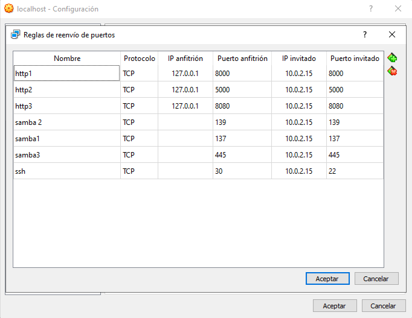

### Programs
```
sudo apt update -y && sudo apt upgrade -y && sudo apt autoremove -y
sudo apt install wget curl nano neovim net-tools traceroute git tree make zip unzip nmap tcpdump mtr dpkg neofetch snap -y
```

### Alias
```
nano ~/.bash_profile
ls=ls -la
```

### oh-my-zsh
```
sudo apt install zsh -y
sh -c "$(wget -O- https://raw.githubusercontent.com/ohmyzsh/ohmyzsh/master/tools/install.sh)"
```

### powerlevel10k
```
git clone --depth=1 https://github.com/romkatv/powerlevel10k.git ${ZSH\_CUSTOM:-$HOME/.oh-my-zsh/custom}/themes/powerlevel10k
```

### Fonts
```bash
nano .zshrc
THEMES="powerlevel10k/powerlevel10k"
source .zshrc
```

### vbox-config-ports


### Selinux
```bash
sudo nano /etc/sysconfig/selinux
sudo nano /etc/selinux/semanage.conf

# SELINUX = disabled
# SELINUXTYPE = Targeted`
````

### firewalld
```bash
sudo apt install firewalld
sudo systemctl enable firewalld
sudo systemctl start firewalld
```

### firewall-cmd
```bash
sudo firewall-cmd --zone=public --permanent --add-port=8000/tcp
sudo firewall-cmd --zone=public --permanent --add-port=5000/tcp
sudo firewall-cmd --zone=public --permanent --add-port=8080/tcp
sudo firewall-cmd --reload
```

### iptables
```bash
sudo apt install iptables-services
systemctl enable iptables
systemctl start iptables

iptables -A INPUT -m state --state NEW -P tcp --dport 8000 ACCEPT
iptables -A INPUT -m state --state NEW -P tcp --dport 5000 ACCEPT
iptables -A INPUT -m state --state NEW -P tcp --dport 8080 ACCEPT
```